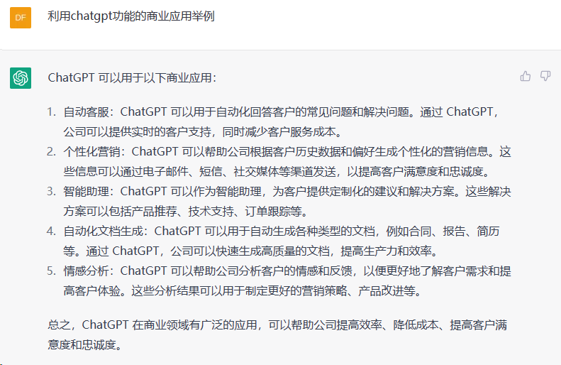
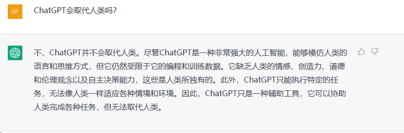
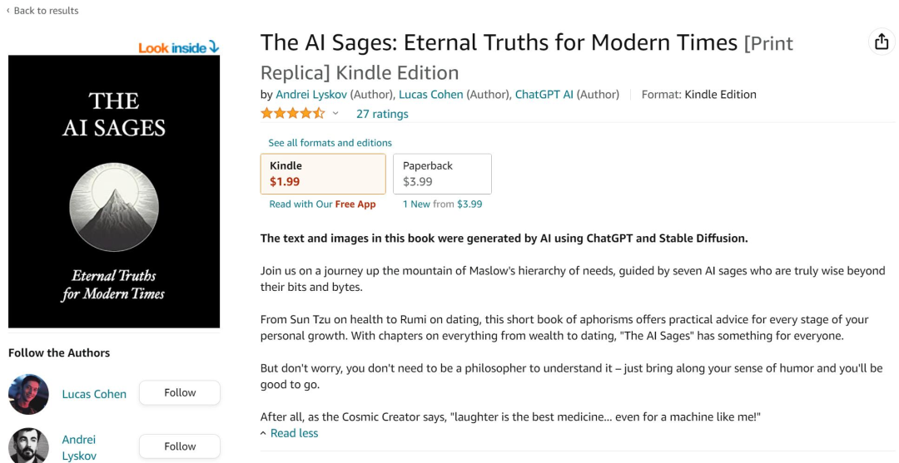
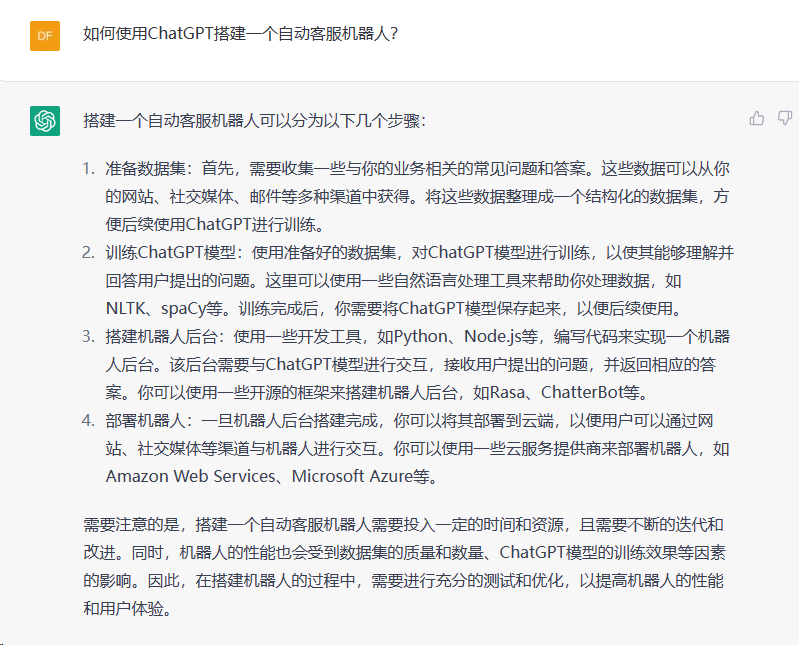
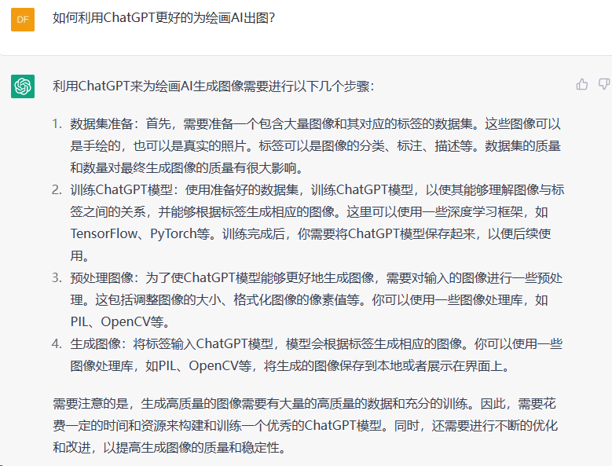

# ChatGPT 应用案例

ChatGPT是由[OpenAI](https://openai.com/)训练的一款大型语言模型，能够生成类人文本。

它能够生成类似于人类写作的文本。您只需要给出提示或提出问题，它就可以生成你想要的东西。

在此页面中，您将找到一些ChatGPT副业赚钱技巧。

# chatgpt的回答

  

# 取代人类

那还挣啥钱奥，直接开启享受人生....
  
那还是加紧挣钱吧

# 出书

颠覆传统图文？ChatGPT写书放网上卖，人类作者：该管管了
  
利用 ChatGPT 写书的例子不在少数。截止 2 月中旬，亚马逊 Kindle 电子书店中有 200 多本电子书将 ChatGPT 列为作者或合著者，主题包括「如何使用 ChatGPT 编写和创建内容」、「家庭作业的力量」和「宇宙的回声诗集」。这个数字每天都在上升。亚马逊上甚至有一个新的子分类：使用 ChatGPT、完全由 ChatGPT 撰写的书籍。

不过，由于 ChatGPT 的属性以及许多作者没有透露自己使用过它，因此几乎不可能全面了解 AI 编写了多少电子书。

# 自动客服

实话实说，ChatGPT的表达能力远超普通人工客服和机器人客服。如果您会接入ChatGPT，那么可以利用您的业余时间，帮助那些需要将ChatGPT接入到公司现有系统中的公司。您还可以根据需求的大小、质量和人工时间进行个性化开发，并进行合理的收费。
  

# 自动出图

没有ChatGPT之前出图的prompt都是需要自己搜集，或者借助相应的prompt网站。现在有了ChatGPT那就省事多了，直接给ChatGPT发指令，就可以出prompt了，当然也需要有调教模型才会出的比较理想哈。至于如何变现，应该不用说了吧。
  
